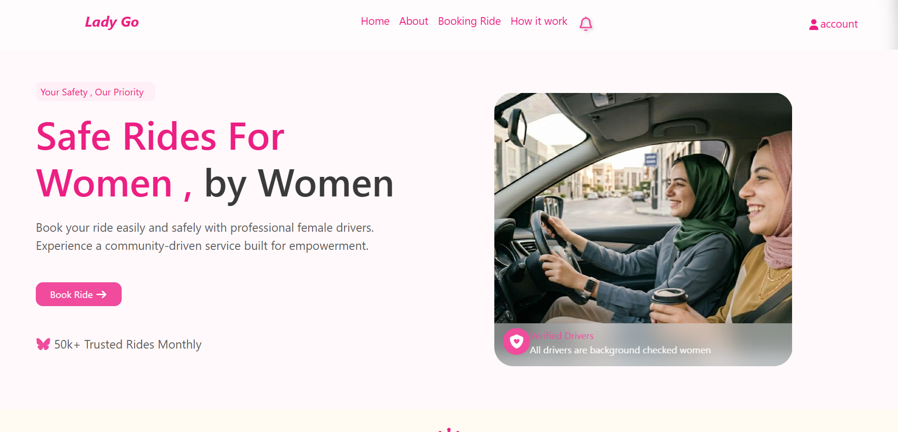
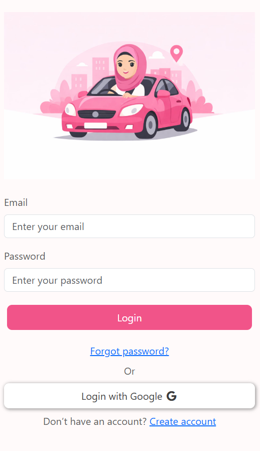
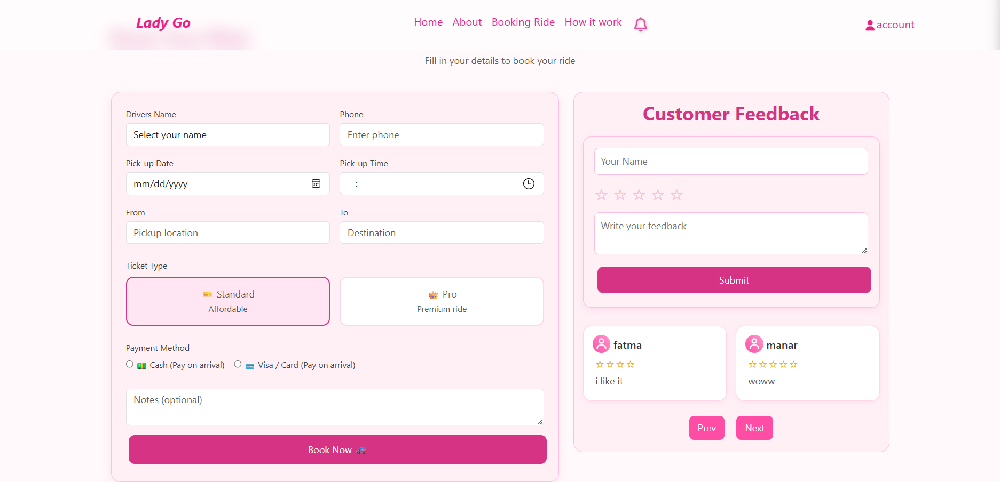
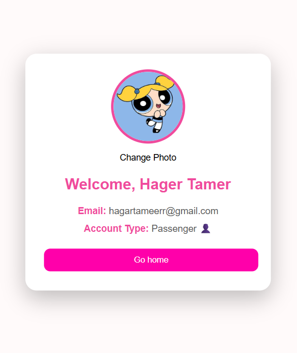

# LadyGo - Girls Ride Booking Web Application

LadyGo is a full-stack web application inspired by ride-booking platforms like Uber, designed specifically for girls to provide a safer, more comfortable, and user-friendly transportation experience.

The project was developed as a university Web Project using modern frontend and backend technologies.

Although the project is not fully completed, we successfully implemented the core functionalities and built a scalable foundation that can be extended with more advanced features in the future.

---

# Technologies Used

## Frontend
- HTML5
- CSS3
- JavaScript
- Bootstrap

## Backend
- Node.js
- Express.js

## Database
- MongoDB

## Tools
- Figma
- Git & GitHub

---

# Main Features

## Authentication System
- User Registration
- User Login
- Form Validation on all forms
- Secure OTP Verification System

---

## OTP Email Verification

After creating an account:

1. The user receives an OTP code via email.
2. The user enters the OTP to verify the account.
3. Once verified, the account data is stored in MongoDB database.

---

##  Login System
- Registered users can log into the application.
- Invalid accounts receive authentication error messages.
- Login validation is implemented for all inputs.

---

#  Ride Booking System

Users can:
- Book rides easily
- Select trip details
- View booking information
- Receive trip updates

---

# Notifications System

After booking a ride:

- A notification appears inside the application.
- An email is sent containing:
  - Pickup location
  - Destination
  - Driver information
  - Car type
  - Car color

---

# User Profile
Each user has:
- Personal profile page
- Account information
- Booking details

---

# Feedback System
Users can submit:
- Feedback
- Reviews
- Suggestions

inside the application.

---

# UI/UX Design

The UI/UX prototype was designed using Figma to provide a modern and user-friendly experience.

👉 [Open Figma Design](https://www.figma.com/design/sAY0e1662pHcXo0RcqqKX3/project?node-id=161-50&t=vC4YHNXN2MILpCf0-1)

---

# Project Preview

## Home Page


## Login Page


## Booking Page


## Profile Page


---

# Team Roles

## Backend Development
Developed by **Hager Tamer**

Responsibilities:
- REST APIs
- Authentication System
- OTP Verification
- Database Integration
- MongoDB Operations
- Backend Logic
- Server-side Development

---

## Frontend Development
Implemented by Team Member

---

## UI/UX Design
Designed by Team Member

---

# Project Structure

```bash
LadyGo
│
├── frontend
│   ├── html files
│   ├── css folder
│   ├── js folder
│   └── img folder
│
├── backend
│   ├── routes
│   ├── config
│   ├── models
│   ├── utils
│   ├── validators
│   ├── controllers
│   ├── middleware
│   ├── server.js
│   ├── app.js
│   ├── .env
│   ├── .env.example
│   └── package.json
│
├── screenshots
│
└── README.md

# Installation & Run

## 1. Clone the Repository

```bash
git clone https://github.com/hajertamer/ladygo.git
```

---

## 2. Open Project Folder

```bash
cd ladygo
```

---

## 3. Open Backend Folder

```bash
cd backend
```

---

## 4. Install Dependencies

```bash
npm install
```

---

## 5. Create `.env` File

Create a `.env` file inside the backend folder and add:

```env
MONGO_URI=your_mongodb_connection
EMAIL_USER=your_email
EMAIL_PASS=your_email_password
PORT=5000
SECRET_KEY =
SALT_ROUNDS =
```

---

## 6. Run the Server

```bash
npm start
```

or

```bash
node server.js
```

---

## 7. Run Frontend

Open `index.html`

or use:

- Live Server Extension in VS Code

---

## 8. Open in Browser

```txt
http://localhost:5000
```
